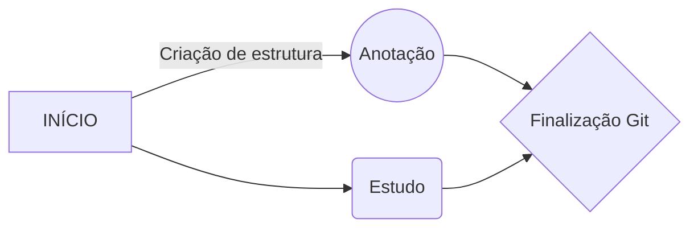

# Primeiro Git do Projeto Integrador-Jogo 2D
Neste projeto iremos acompanhar a criação do projeto integrador do jogo em 2D.

```mermaid
graph LR
A[INÍCIO] -- Criação de estrutura --> B((Anotação))
A --> C(Estudo)
B --> D{Finalização Git}
C --> D
```